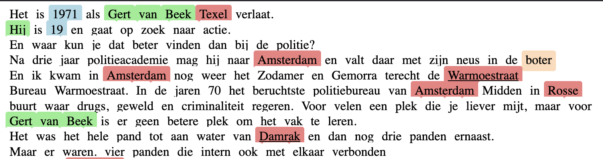

# Meaningful memories

Repository for running the transcription and extraction pipeline for processing oral histories 
in the [Amsterdam Diaries Time Machine project](https://diaries.amsterdamtimemachine.nl/). 

## Components
### Transcription
#### Video to audio
Since the input files for the pipeline are generally videos and we will only transcribe 
the audio, we first convert the input video (MP4) to audio files (WAV). 
#### Model
The audio files are transcribed using [Whisper](https://arxiv.org/abs/2212.04356), specifically
the [whisper-large-v3 model](https://huggingface.co/openai/whisper-large-v3). 

Alternatively, a different model can be substituted (e.g. when computational resources are limited, a smaller
version of Whisper may be preferable) by changing the model settings in the config (see [Setting hyperparameters and optional flags](#setting-hyperparameters-and-optional-flags)).

### Extraction

#### Entities
##### Model
The extraction module uses the [GLiNER model](https://github.com/urchade/GLiNER) for Named Entity Recogntion.

#### Topics
For topic extraction, we use an LLM to do open-ended search for relevant topics.
We make use of [ollama](https://ollama.com/) for serving the model. 
To do so, make sure there is a running instance of ollama on a reachable server.

### Linking 
- [AdamLink](https://adamlink.nl/): street reference data 

## Running the pipeline 

### Preparing input data
Make sure the data is structured in the following way:
```
data/
│-- voornaam1_achternaam1 /
│   │-- interview.mp4
│-- voornaam2_achternaam2 /
│   │-- interview.mp4
```
where voornaam1_achternaam2 should be replaced with the corresponding interviewee's name. 

Alternatively, you can give these folders and files different names (for example, if the interview does not correspond to 
a single person) which will only affect the reference labels in the output. 

### Installation and virtual environment 
To run this code, ideally use a dedicated virtual environment in which all relevant
packages are installed. 
```commandline
python -m venv YOURVENVNAME # create environment
source YOURVENVNAME/bin/activate # activate environment
```
Now install the relevant packages by running the following from the root dir of this repository:
```commandline
pip install . 
```


### Running pipeline 
#### On Snellius
From the root dir of the project, run the following command:
```commandline
sbatch run_pipeline.sh
```
This will send a job to the queue and run on a single A100 GPU. 


#### On local machine 


### Setting hyperparameters and optional flags
The pipeline can be customized by altering the values in the config file. 
These files can be found under `configs`. 

Additionally, some flags can be passed to the pipeline to include or exclude certain 
components from the pipeline. 

For example: 
```commandline
python meaningful_memories/pipeline.py --input_dir input_dir --skip_convert
```
can be used when the input data is already in audio format (WAV).   

### Visualizing results
You can look at the (basic) visualization of the results by opening the generated HTML 
file in a browser. 

This will show the transcript of the interview, with highlighted labels indicating extracted
concepts and entities. The entities for which a corresponding linked item (e.g. a street which has
a mapping in AdamLink) is found, will include an external link to its linked counterpart. 

